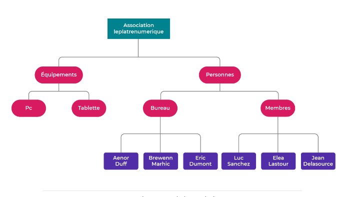

A brand new association, "Le Plâtre Numérique", has just been created and is looking for volunteers to help it in its activities.

One of your friends, a trainer by profession and a founding member of the association, suggests that you come and meet the rest of the board for a very specific request: they would like to set up an internal directory within the association, to be able to give different functions or rights to members on the future computer system.

During this meeting, the association's office provides you with the following organisation chart:

